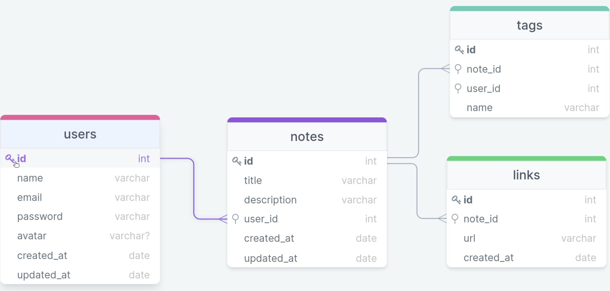

<h1 align="center"> Rocketnotes API </h1>

<p align="center">
Explorer is a complete program that brings together all that is needed to develop technical and behavioral skills, with monitoring by a qualified team from Rocketseat, to achieve the first position in the programming market. <br/>
</p>

<p align="center">
  <a href="#about">About</a>&nbsp;&nbsp;&nbsp;|&nbsp;&nbsp;&nbsp;
  <a href="#db-schema">Database schema</a>&nbsp;&nbsp;&nbsp;|&nbsp;&nbsp;&nbsp;
  <!-- <a href="#endpoints">API endpoints</a>&nbsp;&nbsp;&nbsp;|&nbsp;&nbsp;&nbsp; -->
  <a href="#technologies">Technologies</a>&nbsp;&nbsp;&nbsp;|&nbsp;&nbsp;&nbsp;
  <a href="#license">License</a>
</p>

<p align="center">
  
</p>

<br>

<h2 id="about">👨🏽‍💻 About</h2>

This project proposes the development of an application in Node.js where the user registers a note, fills in some information like name, description, tags and links.

<h2 id="db-schema">🎲 Database schema</h2>

<p align="center">
  
</p>

<br>

<!-- <h2 id="db-schema">🎯 API endpoints</h2>

<h3>Users</h3>

```http
POST /users
```

| Body | Schema | Description |
| :-- | :-- | :-- |
| **required** | ```json {"name": "STRING", "email": STRING, "password": STRING}``` | Create user | -->

<br>

<h2 id="technologies">🚀 Technologies</h2>

This project was developed with the following technologies:

- Javascript
- Node JS
- Express
- bcryptjs
- knex
- Nodemon
- SQL and SQLite
- Beekeeper Studio
- Insomnia
- Git and Github

<h2 id="license">📜 License</h2>

This project is under the MIT license.

---
Note: <strong style="color: #643cbb">README.md</strong> inspired by <a href="https://github.com/maykbrito/boracodar/tree/main/01" target="_blank">https://github.com/maykbrito/boracodar/tree/main/01</a>
